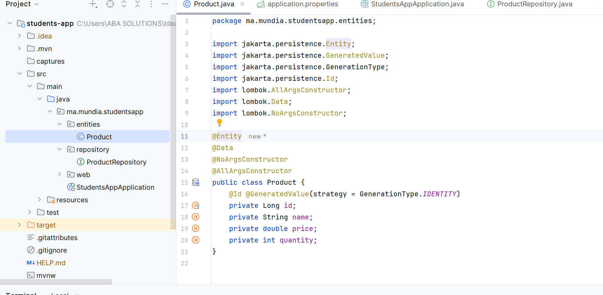

<h3> COMPTE RENDU </h3>

<h1>En suivant les étapes de la vidéo nous avons pu créer notre première application grace au framework Spring </h1> 

<h1> Au cours des etapes nous avons cree les differentes classes qui constituent le projet complet de l'appli  </h1> 

<h1> En ayant termine la partie du tp primaire on comprends que spring injecte tout tout seul et facilite le travail des developpeurs pour la suite du travail </h1>
