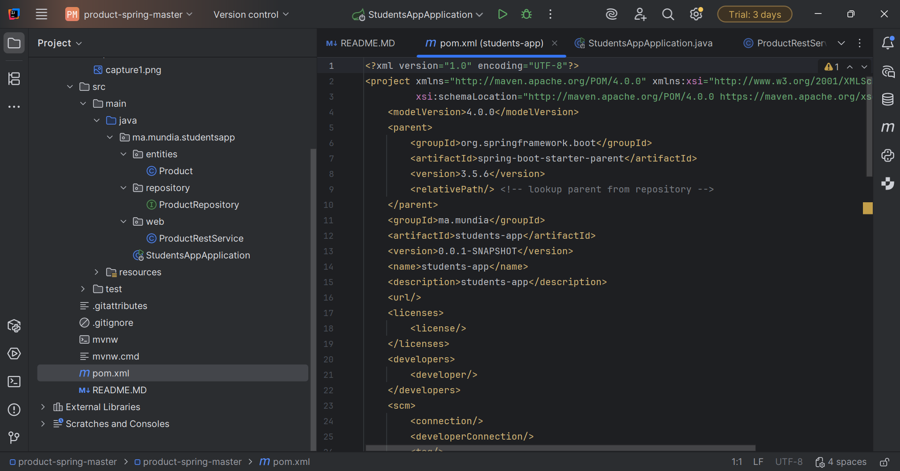
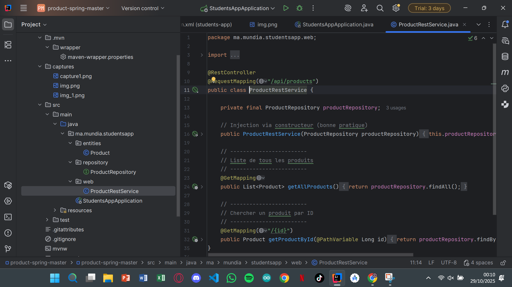
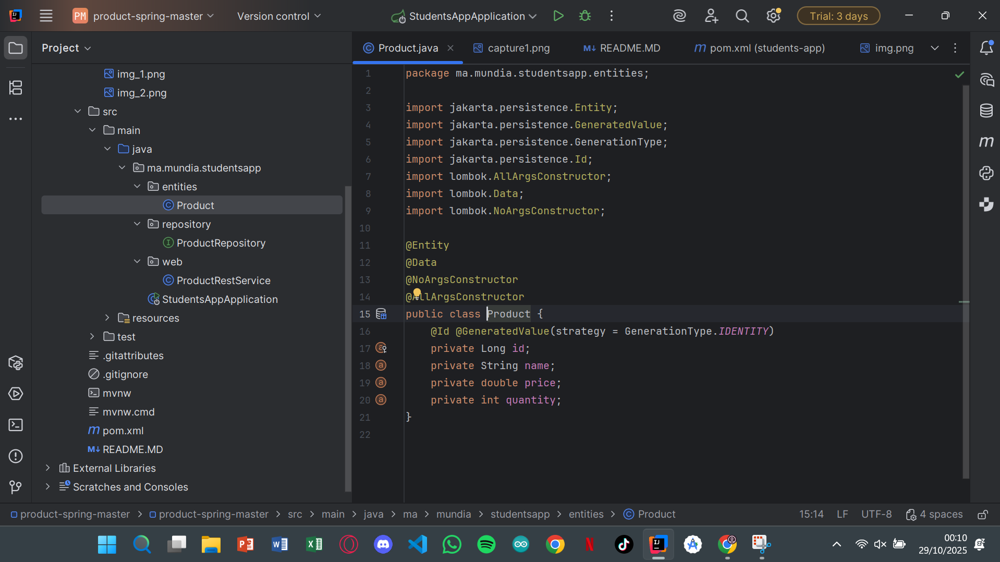

# 🧾 Compte Rendu

## 📌 Introduction

En suivant les étapes de la vidéo, nous avons pu **créer notre première application grâce au framework Spring Boot**.

---

## 📸 Captures d’écran

### 1️⃣ Lancement du projet

### 2️⃣ Configuration de l’application

### 3️⃣ Création des classes principales

Nous avons créé les différentes classes qui constituent l’application complète.

---

### 4️⃣ Structure finale du projet

---

## 💡 Conclusion

En terminant cette première partie du TP, nous avons compris que **Spring Boot injecte automatiquement les dépendances** et **simplifie énormément le travail du développeur** pour la suite du projet.
